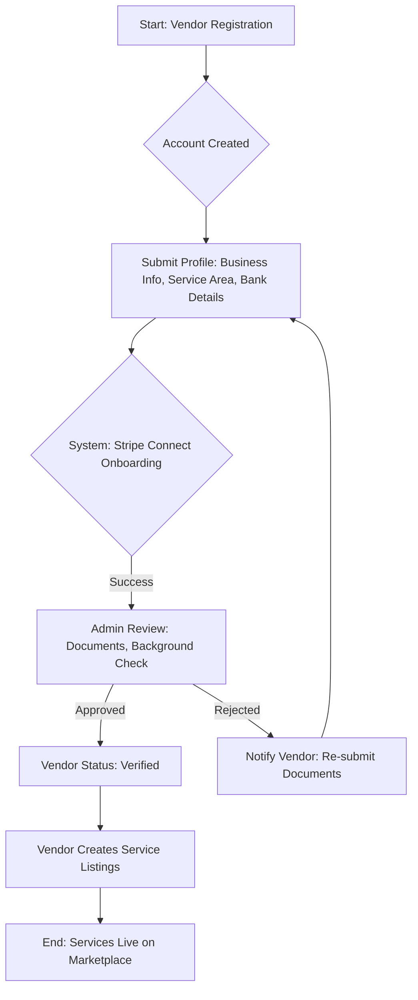

# Marketplace Core Process Flows: System Design

This document outlines the three critical process flows for your service-based marketplace, providing a clear, step-by-step view of the system's operation from vendor entry to final payment.

## 1. Vendor Onboarding Flow

The Vendor Onboarding Flow is designed to establish trust and ensure all organizers are properly vetted and set up for secure transactions.



### Explanation of Steps:

1.  **Start: Vendor Registration**: The organizer signs up for an account, selecting the "Vendor" role.
2.  **Submit Profile**: The vendor provides all necessary business information, including their service area (critical for localized services), and links their bank account.
3.  **System: Stripe Connect Onboarding**: The system uses a payment gateway like Stripe Connect to securely collect and verify the vendor's financial information, which is necessary for future payouts and compliance.
4.  **Admin Review**: A manual step where the marketplace administrator reviews the vendor's submitted documents, certifications, and portfolio, and initiates a background check.
5.  **Vendor Status: Verified**: Upon approval, the vendor's status is updated, granting them full access to the platform.
6.  **Vendor Creates Service Listings**: The verified vendor can now create and publish their service packages, setting their pricing and availability.
7.  **End: Services Live on Marketplace**: The organizer's services are now visible and bookable by customers.

## 2. Customer Booking Flow

This flow details the customer's journey from searching for an organizer to confirming the service and initiating the payment process.

```mermaid
graph TD
    A[Start: Customer Search] --> B{Filter by Service, Location, Availability};
    B --> C[View Vendor Profiles & Service Listings];
    C --> D{Select Service & Time Slot};
    D --> E[Submit Booking Request];
    E --> F{System: Check Vendor Real-Time Availability};
    F -- Available --> G[Customer Payment: Capture Funds];
    F -- Not Available --> H[Notify Customer: Suggest Alternatives];
    G --> I[Booking Status: Confirmed (Funds in Escrow)];
    I --> J[Service Execution (Offline)];
    J --> K{Customer Confirmation: Service Completed?};
    K -- Yes --> L[End: Proceed to Payout];
    K -- No --> M[Dispute Resolution Process];
    H --> B;
```

### Explanation of Steps:

1.  **Search & Filter**: The customer uses filters (service type, location, date) to find suitable organizers.
2.  **Select Service & Time Slot**: The customer chooses a specific service package and a time slot based on the vendor's synced calendar.
3.  **Submit Booking Request**: The customer commits to the booking.
4.  **System: Check Availability**: The system performs a final, real-time check against the vendor's calendar.
5.  **Customer Payment: Capture Funds**: If available, the customer is prompted to pay the full service fee. The funds are immediately captured but **held in escrow**.
6.  **Booking Status: Confirmed**: The booking is confirmed, and both parties receive notifications.
7.  **Service Execution (Offline)**: The organizer performs the service at the agreed-upon time and location.
8.  **Customer Confirmation**: The customer explicitly confirms that the service was completed satisfactorily. This is the trigger for the payment release.
9.  **Dispute Resolution Process**: If the customer is not satisfied, the process is diverted to an administrative review.

## 3. Escrow Payment and Payout Flow

This is the financial backbone of the marketplace, ensuring secure transactions and managing the platform's commission.

```mermaid
graph TD
    A[Start: Booking Confirmed] --> B[Funds Held in Escrow (Stripe Connect)];
    B --> C{Service Completion Confirmed by Customer};
    C -- Yes --> D[System: Calculate Commission (e.g., 15%)];
    C -- No (Dispute) --> E[Admin: Investigate & Decide Payout];
    D --> F[Initiate Payout: Vendor Share];
    D --> G[Transfer: Platform Commission];
    F --> H[Vendor Receives Funds];
    G --> I[Platform Receives Funds];
    H --> J[End: Transaction Complete];
    I --> J;
```

### Explanation of Steps:

1.  **Funds Held in Escrow**: The customer's payment is securely held by the payment gateway (e.g., Stripe Connect) and is not immediately released to the vendor.
2.  **Service Completion Confirmed**: This is the critical decision point, triggered by the customer's confirmation in the Booking Flow.
3.  **System: Calculate Commission**: The system automatically calculates the platform's commission (e.g., 15%) and the remaining vendor share.
4.  **Initiate Payout: Vendor Share**: The system instructs the payment gateway to release the vendor's portion of the funds to their linked bank account.
5.  **Transfer: Platform Commission**: The system instructs the payment gateway to transfer the commission directly to the marketplace's bank account.
6.  **Admin: Investigate & Decide Payout**: In case of a dispute, an administrator reviews the case and manually determines the appropriate payout (full, partial, or refund).
7.  **End: Transaction Complete**: Both the vendor and the platform have received their respective funds, and the transaction is closed.
